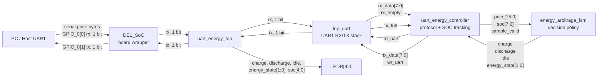
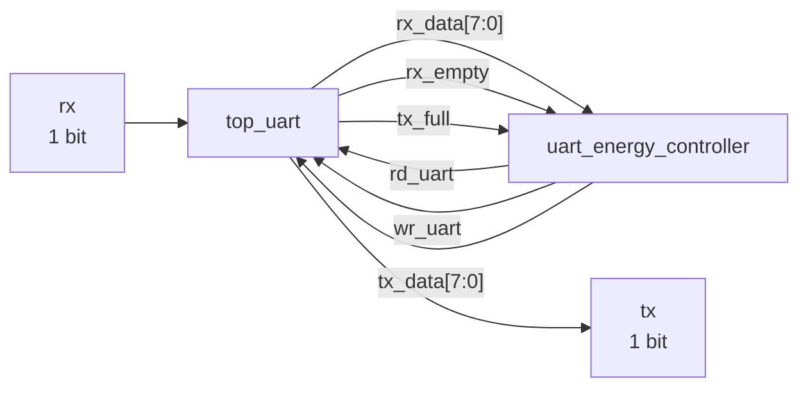
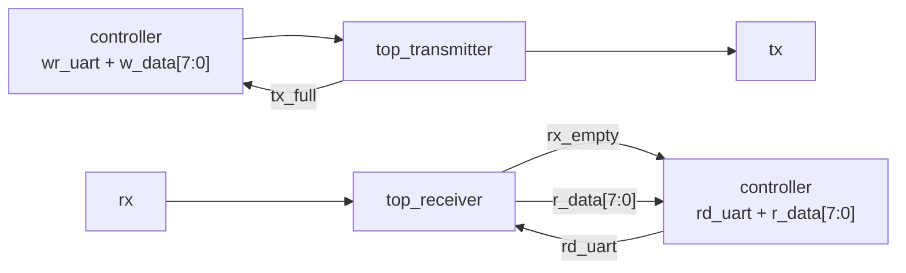
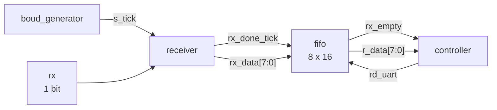
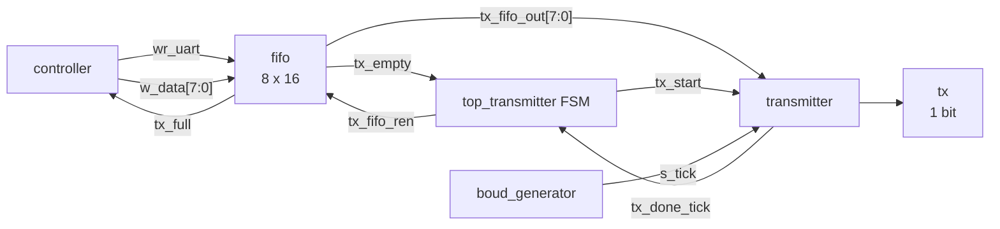

# UART Energy Arbitrage Block Diagram

This document maps the full design hierarchy and the signals between blocks.

## Top Level

## DE1_SoC Wrapper

| Signal | Width | Direction | Connects To | Meaning |
| --- | ---: | --- | --- | --- |
| `CLOCK_50` | 1 | input | `uart_energy_top.clk` | 50 MHz board clock |
| `KEY[3:0]` | 4 | input | `KEY[0]` used for reset | Board push buttons |
| `GPIO_0[1:0]` | 2 | inout | UART pins | `GPIO_0[0]` RX, `GPIO_0[1]` TX |
| `LEDR[9:0]` | 10 | output | board LEDs | Action, state, and SOC display |
| `rst` | 1 | internal | `uart_energy_top.rst` | Active-high reset, assigned from `~KEY[0]` |
| `uart_rx` | 1 | internal | `uart_energy_top.rx` | Serial input from `GPIO_0[0]` |
| `uart_tx` | 1 | internal | `GPIO_0[1]` | Serial output from UART TX |
| `charge` | 1 | internal | `LEDR[0]` | Charge action indicator |
| `discharge` | 1 | internal | `LEDR[1]` | Discharge action indicator |
| `idle` | 1 | internal | `LEDR[2]` | Idle action indicator |
| `price[15:0]` | 16 | internal | debug/output from DUT | Last received price |
| `soc[7:0]` | 8 | internal | `LEDR[9:5] = soc[4:0]` | Internal battery percentage |
| `energy_state[1:0]` | 2 | internal | `LEDR[4:3]` | FSM encoded state |

## uart_energy_top

| Signal | Width | Direction From `uart_energy_top` | Producer | Consumer | Meaning |
| --- | ---: | --- | --- | --- | --- |
| `clk` | 1 | input | `DE1_SoC.CLOCK_50` | all submodules | System clock |
| `rst` | 1 | input | `DE1_SoC.rst` | all submodules | Active-high reset |
| `rx` | 1 | input | board UART RX pin | `top_uart` | Serial UART input |
| `tx` | 1 | output | `top_uart` | board UART TX pin | Serial UART output |
| `charge` | 1 | output | controller/FSM | board LEDs | Charge decision |
| `discharge` | 1 | output | controller/FSM | board LEDs | Discharge decision |
| `idle` | 1 | output | controller/FSM | board LEDs | Idle decision |
| `price[15:0]` | 16 | output | controller | board wrapper/debug | Last assembled price |
| `soc[7:0]` | 8 | output | controller | board wrapper/debug | Internal SOC |
| `energy_state[1:0]` | 2 | output | controller/FSM | board wrapper/debug | Encoded state |
| `wr_uart` | 1 | internal | controller | UART TX FIFO | Write `tx_data` into TX path |
| `rd_uart` | 1 | internal | controller | UART RX FIFO | Read one received byte |
| `tx_full` | 1 | internal | UART TX FIFO | controller | TX FIFO cannot accept data |
| `rx_empty` | 1 | internal | UART RX FIFO | controller | RX FIFO has no data |
| `tx_data[7:0]` | 8 | internal | controller | UART TX FIFO | Response byte |
| `rx_data[7:0]` | 8 | internal | UART RX FIFO | controller | Received byte |
| `sample_valid` | 1 | internal | controller | energy FSM | One-cycle valid pulse |

## top_uart

| Signal | Width | Direction | Producer | Consumer | Meaning |
| --- | ---: | --- | --- | --- | --- |
| `clk` | 1 | input | top | TX/RX paths | System clock |
| `rst` | 1 | input | top | TX/RX paths | Active-high reset |
| `wr_uart` | 1 | input | controller | `top_transmitter` | Enqueue byte for transmit |
| `rd_uart` | 1 | input | controller | `top_receiver` | Dequeue received byte |
| `rx` | 1 | input | board/host | `top_receiver` | Serial input |
| `w_data[7:0]` | 8 | input | controller | `top_transmitter` | Byte to transmit |
| `tx` | 1 | output | `top_transmitter` | board/host | Serial output |
| `tx_full` | 1 | output | `top_transmitter` | controller | TX FIFO full |
| `rx_empty` | 1 | output | `top_receiver` | controller | RX FIFO empty |
| `r_data[7:0]` | 8 | output | `top_receiver` | controller | Byte from RX FIFO |

## Receive Path

| Signal | Width | Producer | Consumer | Meaning |
| --- | ---: | --- | --- | --- |
| `rx` | 1 | host | `receiver` | UART serial input |
| `s_tick` | 1 | `boud_generator` | `receiver` | 16x baud sampling tick |
| `rx_done_tick` | 1 | `receiver` | RX FIFO `wr` | One-cycle pulse when byte received |
| `rx_data[7:0]` | 8 | `receiver` | RX FIFO `w_data` | Received byte |
| `rd_uart` | 1 | controller | RX FIFO `ren` | Read request |
| `rx_empty` | 1 | RX FIFO | controller | No received byte available |
| `r_data[7:0]` | 8 | RX FIFO | controller | Registered FIFO read data |
| `rx_full` | 1 | RX FIFO | internal unused | RX FIFO full flag |

## Transmit Path

| Signal | Width | Producer | Consumer | Meaning |
| --- | ---: | --- | --- | --- |
| `wr_uart` | 1 | controller | TX FIFO `wr` | Write response byte into TX FIFO |
| `w_data[7:0]` | 8 | controller | TX FIFO `w_data` | Response byte |
| `tx_full` | 1 | TX FIFO | controller | TX FIFO full |
| `tx_empty` | 1 | TX FIFO | TX control FSM | No byte waiting to transmit |
| `tx_fifo_ren` | 1 | TX control FSM | TX FIFO `ren` | Read next byte from TX FIFO |
| `tx_fifo_out[7:0]` | 8 | TX FIFO | `transmitter` | Registered byte to serialize |
| `tx_start` | 1 | TX control FSM | `transmitter` | Start serializing `tx_fifo_out` |
| `s_tick` | 1 | `boud_generator` | `transmitter` | 16x baud timing tick |
| `tx_done_tick` | 1 | `transmitter` | TX control FSM | Byte transmission complete |
| `tx` | 1 | `transmitter` | board/host | UART serial output |

## uart_energy_controller

The controller is the main protocol FSM. It reads two received bytes, builds a 16-bit price, pulses the decision FSM, updates SOC, and sends two response bytes.

| Signal | Width | Direction | Meaning |
| --- | ---: | --- | --- |
| `clk` | 1 | input | System clock |
| `rst` | 1 | input | Active-high reset |
| `rx_empty` | 1 | input | RX FIFO empty flag |
| `rx_data[7:0]` | 8 | input | Byte from RX FIFO |
| `rd_uart` | 1 | output | RX FIFO read pulse |
| `tx_full` | 1 | input | TX FIFO full flag |
| `wr_uart` | 1 | output | TX FIFO write pulse |
| `tx_data[7:0]` | 8 | output | Byte to TX FIFO |
| `price[15:0]` | 16 | output/internal state | Last assembled price |
| `soc[7:0]` | 8 | output/internal state | Battery state of charge |
| `sample_valid` | 1 | output | One-cycle valid pulse to decision FSM |
| `charge` | 1 | output | Decision output from FSM |
| `discharge` | 1 | output | Decision output from FSM |
| `idle` | 1 | output | Decision output from FSM |
| `energy_state[1:0]` | 2 | output | Encoded FSM state |
| `byte_state[3:0]` | 4 | internal | Controller FSM state |
| `price_hi[7:0]` | 8 | internal | First received price byte |
| `response_soc[7:0]` | 8 | internal | SOC byte queued for response |

### Controller FSM States

| State | Encoding | Purpose |
| --- | ---: | --- |
| `WAIT_PRICE_HI` | `4'd0` | Wait for price high byte in RX FIFO |
| `READ_PRICE_HI` | `4'd1` | Wait one cycle for registered FIFO read data |
| `SAVE_PRICE_HI` | `4'd2` | Store `rx_data` into `price_hi` |
| `WAIT_PRICE_LO` | `4'd3` | Wait for price low byte in RX FIFO |
| `READ_PRICE_LO` | `4'd4` | Wait one cycle for registered FIFO read data |
| `SAVE_PRICE_LO` | `4'd5` | Build `price = {price_hi, rx_data}` and pulse `sample_valid` |
| `WAIT_FSM` | `4'd6` | Wait one cycle for decision FSM to register new state |
| `UPDATE_SOC` | `4'd7` | Increment, decrement, or keep SOC based on `energy_state` |
| `SEND_STATUS` | `4'd8` | Send `B`, `S`, or `I` when TX FIFO has room |
| `SEND_SOC` | `4'd9` | Send updated SOC byte |

## energy_arbitrage_fsm

| Signal | Width | Direction | Meaning |
| --- | ---: | --- | --- |
| `clk` | 1 | input | System clock |
| `rst` | 1 | input | Active-high reset |
| `price[15:0]` | 16 | input | Current price sample |
| `soc[7:0]` | 8 | input | Current SOC from controller |
| `valid` | 1 | input | Decision update enable |
| `charge` | 1 | output | Asserted in BUY state |
| `discharge` | 1 | output | Asserted in SELL state |
| `idle` | 1 | output | Asserted in IDLE/default state |
| `state[1:0]` | 2 | output | Encoded decision state |

| State | Encoding | Condition |
| --- | ---: | --- |
| `S_IDLE` | `2'b00` | Default, or no buy/sell condition met |
| `S_BUY` | `2'b01` | `price < 3000` and `soc < 90` |
| `S_SELL` | `2'b10` | `price > 3600` and `soc > 20` |

## Reusable Blocks

### fifo

Default configuration is 8-bit data width and 16 entries.

| Signal | Width | Direction | Meaning |
| --- | ---: | --- | --- |
| `clk` | 1 | input | System clock |
| `rst` | 1 | input | Active-high reset |
| `ren` | 1 | input | Read enable |
| `wr` | 1 | input | Write enable |
| `w_data[7:0]` | 8 | input | Write data |
| `empty` | 1 | output | FIFO empty |
| `full` | 1 | output | FIFO full |
| `r_data[7:0]` | 8 | output | Registered read data |
| `mem_fifo[15:0][7:0]` | 128 | internal | FIFO storage |
| `rd_ptr[4:0]` | 5 | internal | Read pointer with wrap bit |
| `wr_ptr[4:0]` | 5 | internal | Write pointer with wrap bit |

### boud_generator

Default configuration is 50 MHz clock, 9600 baud, 16x sampling.

| Signal | Width | Direction | Meaning |
| --- | ---: | --- | --- |
| `clk` | 1 | input | System clock |
| `rst` | 1 | input | Active-high reset |
| `tick` | 1 | output | 16x UART sample tick |
| `counter[N-1:0]` | 9 default | internal | Divider counter |

### transmitter

| Signal | Width | Direction | Meaning |
| --- | ---: | --- | --- |
| `clk` | 1 | input | System clock |
| `rst` | 1 | input | Active-high reset |
| `tx_start` | 1 | input | Start transmitting `tx_data` |
| `tx_data[7:0]` | 8 | input | Byte to serialize |
| `s_tick` | 1 | input | 16x baud tick |
| `tx_done_tick` | 1 | output | One-cycle done pulse |
| `tx` | 1 | output | Serial UART output |
| `s_reg[3:0]` | 4 | internal | 16x tick counter |
| `n_reg[2:0]` | 3 | internal | Data bit counter |
| `b_reg[7:0]` | 8 | internal | Shift register |
| `state[1:0]` | 2 | internal | UART TX FSM state |

### receiver

| Signal | Width | Direction | Meaning |
| --- | ---: | --- | --- |
| `clk` | 1 | input | System clock |
| `rst` | 1 | input | Active-high reset |
| `rx` | 1 | input | Serial UART input |
| `s_tick` | 1 | input | 16x baud tick |
| `rx_done_tick` | 1 | output | One-cycle done pulse |
| `rx_data[7:0]` | 8 | output | Received byte |
| `s_reg[3:0]` | 4 | internal | 16x tick counter |
| `n_reg[2:0]` | 3 | internal | Data bit counter |
| `b_reg[7:0]` | 8 | internal | Shift register |
| `state[1:0]` | 2 | internal | UART RX FSM state |
